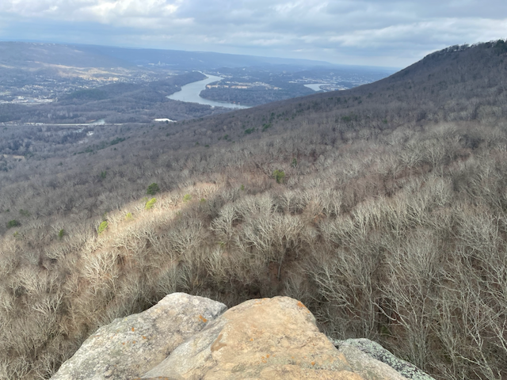

Happy second day of Christmas!
I just got back from a short hike (around 3.5 miles) of Lookout
Mountain's Bluff Trail with my son, nephew, and brother-in-law.
We ended our walk at Sunset Rock, where we had hot chocolate before
heading up to the trailhead.

The trail is part of the [Chickamauga & Chattanooga National Military
Park][chch].
I took the pictures below on Sunset Rock, looking out over Tennessee.
You can see the outskirts of the city of Chattanooga in the distance
toward the right side of the top picture.

[chch]: https://www.nps.gov/chch/index.htm
